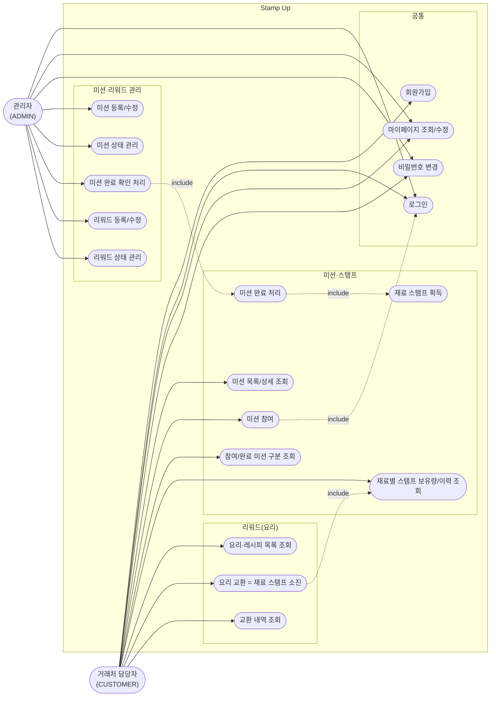

# 유스케이스 다이어그램 — Stamp Up

`1-domain-definition.md` 5장(유스케이스)을 기반으로 작성. Mermaid는 UML 유스케이스 다이어그램 전용 문법이 없어 `flowchart`로 액터·시스템 경계·유스케이스를 표현한다.

## 범례
- `-->` : 액터가 수행하는 유스케이스
- `-. include .->` : 한 유스케이스가 다른 유스케이스를 반드시 포함/유발함
  - 미션 참여는 로그인 상태를 전제로 한다
  - 미션 완료 처리는 스탬프 획득으로 이어진다 (7장 규칙: 조합당 1회)
  - 관리자의 완료 확인 처리는 거래처 담당자의 미션 완료 처리와 동일 흐름을 확정한다
  - 요리 교환은 레시피에 명시된 모든 재료 종류를 필요 수량 이상 보유하고 있는지 확인을 전제로 한다 (`1-domain-definition.md` v1.2 Reward.recipe 참고)
