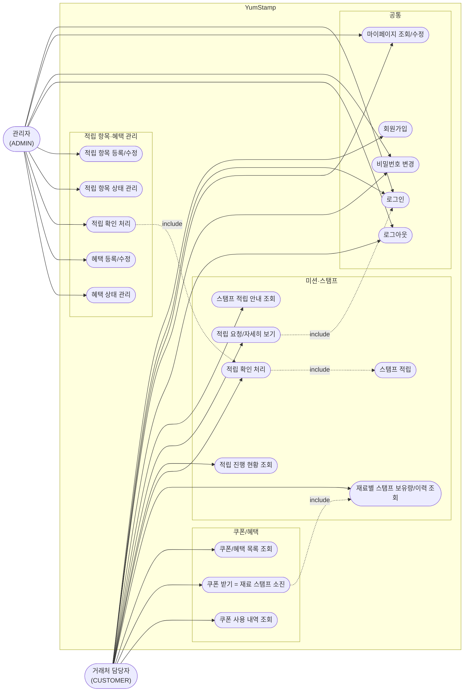

# 유스케이스 다이어그램 — YumStamp

`1-domain-definition.md` 5장(유스케이스, v1.6)을 기반으로 작성. Mermaid는 UML 유스케이스 다이어그램 전용 문법이 없어 `flowchart`로 액터·시스템 경계·유스케이스를 표현한다. 로그인 인증 방식(access/refresh token)의 기술적 구현은 `3-PRD.md` 4·5장 참고.

> 표시 텍스트의 용어는 `7-wireframe.md` 0장 매핑 기준(내부 엔티티명·id는 변경 없음).

## 범례
- `-->` : 액터가 수행하는 유스케이스
- `-. include .->` : 한 유스케이스가 다른 유스케이스를 반드시 포함/유발함
  - 적립 요청/자세히 보기는 로그인 상태를 전제로 한다
  - 적립 확인 처리는 스탬프 적립으로 이어진다 (7장 규칙: 조합당 1회)
  - 관리자의 확인 처리는 거래처 담당자 쪽의 적립 확인 처리와 동일 흐름을 확정한다
  - 쿠폰 받기는 레시피에 명시된 모든 재료 종류를 필요 수량 이상 보유하고 있는지 확인을 전제로 한다 (`1-domain-definition.md` v1.2 Reward.recipe 참고)

> UC13(적립 확인 처리)은 거래처 담당자의 테스트용 셀프 확인과 관리자 확인 두 경로 모두로 도달 가능하다 (도메인 정의서 7장: "테스트용 완료 처리 또는 관리자 확인"). customer→UC13과 admin→UC32-.include.->UC13이 같은 처리 로직을 공유한다.
