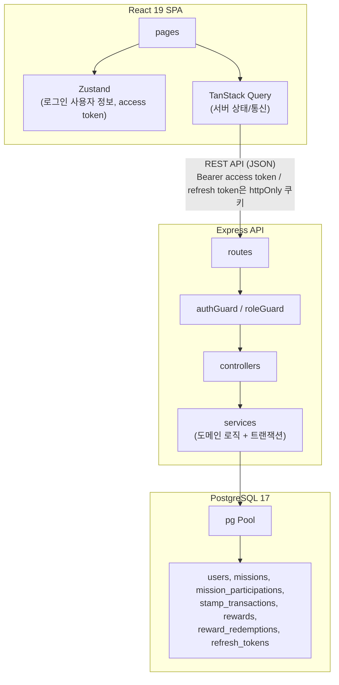

# 기술 아키텍처 다이어그램 — YumStamp

버전: v1.2 (작성일: 2026-08-13, v1.1→v1.2: docs 정합성 검토 — 근거 문서 버전 갱신, 프론트엔드 컴포넌트 다이어그램에 스탬프 홈 페이지 추가)
근거 문서: `docs/3-PRD.md` (v1.5, 5장), `docs/5-project-principle.md` (v1.1, 2장·6~7장)

> 3-레이어(routes → controllers/services → db) 구조를 그대로 시각화한 정적 아키텍처 다이어그램 1개. PRD/설계원칙에 없는 로드밸런서·캐시 레이어·메시지 큐·별도 인증서버 등은 추가하지 않는다.

---

## 다이어그램

---

## 레이어 설명

- **React 19 SPA**: 화면(pages)에서 서버 데이터/통신은 TanStack Query, 로그인 사용자 정보와 access token(메모리)은 Zustand가 담당한다. access token 만료(401) 시 refresh token으로 재발급 후 원요청을 재시도한다.
- **Express API**: routes는 요청 파싱과 authGuard(JWT 검증)/roleGuard(ADMIN 체크) 연결만 담당하고, controllers는 요청→서비스 호출→응답 변환만, services가 참여/완료/스탬프지급/교환 등 실제 도메인 로직과 DB 트랜잭션(BEGIN/COMMIT)을 수행한다.
- **PostgreSQL 17**: services는 pg Pool을 통해서만 DB에 접근하며, 미션 완료 처리·리워드 교환은 각각 단일 트랜잭션으로 원자성을 보장한다.

---

## 프론트엔드 컴포넌트 구조

`5-project-principle.md` 6장 디렉토리 구조를 그대로 시각화. Pages는 화면 단위로만 묶고, 별도 컨테이너/프레젠테이셔널 컴포넌트 분리 같은 추가 레이어는 도입하지 않는다.

```mermaid
flowchart TB
    App["App.tsx"] --> Router["routes/router.tsx<br/>(인증가드 / ADMIN 역할가드)"]

    subgraph Pages["pages/"]
        AuthPages["auth/<br/>Login, Signup"]
        HomePage["home/<br/>StampHome(첫 화면)"]
        MissionPages["missions/<br/>MissionList, MissionDetail, MyMissions"]
        StampPages["stamps/<br/>Stamps"]
        RewardPages["rewards/<br/>RewardList, MyRedemptions"]
        MyPage["mypage/<br/>MyPage"]
        AdminPages["admin/<br/>MissionManage, RewardManage"]
    end

    Router --> AuthPages
    Router --> HomePage
    Router --> MissionPages
    Router --> StampPages
    Router --> RewardPages
    Router --> MyPage
    Router --> AdminPages

    Pages --> Components["components/<br/>(공용 순수 UI)"]
    Pages --> Hooks["hooks/<br/>(TanStack Query, 엔티티별)"]
    Hooks --> Api["api/<br/>(fetch 래퍼, client.ts에서 401→refresh 재시도)"]
    Pages --> Store["store/authStore.ts<br/>(Zustand: 로그인 사용자, access token)"]
```

- **routes/router.tsx**: 로그인 필요 여부, ADMIN 전용 페이지 여부를 라우트 정의 시점에 가드로 처리한다 (페이지 컴포넌트 내부에서 매번 체크하지 않음).
- **pages/**: 화면 단위 1파일 원칙. 서버 데이터가 필요하면 `hooks/`, 인증 상태가 필요하면 `store/`를 직접 가져다 쓰고, 별도 상태관리 중간 레이어는 두지 않는다.
- **components/**: 여러 페이지에서 재사용하는 순수 UI에 한정 — 페이지 전용 마크업을 조기에 컴포넌트로 쪼개지 않는다.
