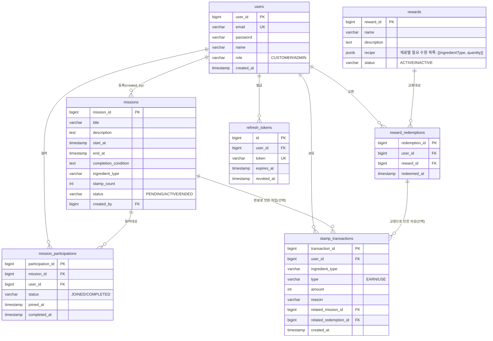

# ERD — Stamp Up (식자재 유통 B2B 미션형 프로모션·스탬프 리워드)

버전: v1.1 (작성일: 2026-08-13, v1.0→v1.1: 근거 문서 버전 갱신, 내용 변경 없음 — PRD v1.3→v1.4 변경분은 5.2절 pages 목록 추가뿐이라 ERD에 영향 없음)
근거 문서: `docs/1-domain-definition.md` (v1.6), `docs/3-PRD.md` (v1.5, 5장 기술스택/DB 테이블/인덱스)

---

## ERD

`mission_participations(mission_id, user_id)`는 유니크 제약(UK, PRD 5.2 인덱스 기준)을 가지며, 동일 (미션, 사용자) 조합의 중복 참여를 DB 레벨에서 방지한다. Mermaid erDiagram 문법상 복합 유니크 제약은 컬럼 단위 표기(PK/FK/UK)로 완전히 표현할 수 없어, 위 다이어그램에서는 각 컬럼을 FK로 표시하고 이 텍스트로 복합 UK를 보강 설명한다.

---

## 테이블별 역할

- **users**: 거래처 담당자(CUSTOMER) 및 관리자(ADMIN) 계정 정보를 저장한다.
- **missions**: 관리자가 등록하는 미션형 프로모션(참여 기간, 완료 조건, 지급 재료 종류·수량, 상태)을 저장한다.
- **mission_participations**: 사용자별 미션 참여/완료 기록을 저장하며, (mission_id, user_id) 조합당 1건만 존재한다.
- **stamp_transactions**: 재료 종류별 스탬프 적립(EARN)/차감(USE) 이력을 저장하며, 보유 잔액은 이 이력의 합으로 산출한다.
- **rewards**: 재료 스탬프 조합으로 교환하는 요리(리워드)와 레시피(recipe, JSONB)를 저장한다.
- **reward_redemptions**: 사용자의 리워드(요리) 교환 내역을 저장한다.
- **refresh_tokens**: 로그인 세션 유지용 refresh token을 저장하며, 로그아웃/재발급 시 폐기(revoked_at) 처리된다.
