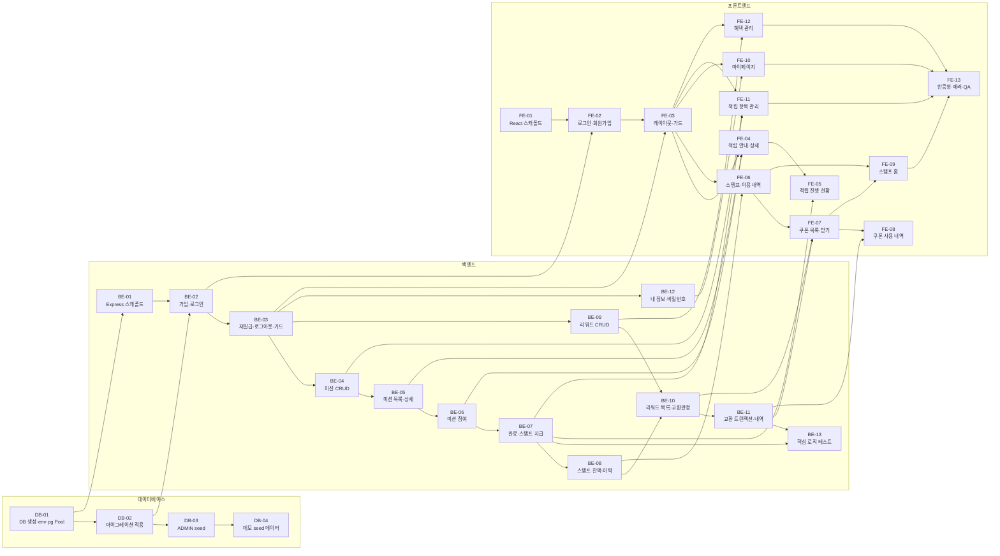

# 개발 실행계획 — Stamp Up

버전: v1.18 (작성일: 2026-08-13, v1.17→v1.18: BE-12 완료 처리 — 내 정보 조회/수정·비밀번호 변경(/users/me) 구현 및 테스트 통과 확인, 완료조건 체크. 부수적으로 auth.service.js의 refresh token 발급에 jwtid(crypto.randomUUID) 추가 — 동일 유저 1초 내 재로그인 시 토큰 문자열 충돌로 인한 UNIQUE 제약 위반 버그 수정)
근거 문서: `docs/1-domain-definition.md` (v1.6), `docs/2-usecase.md`, `docs/3-PRD.md` (v1.5), `docs/4-user-scenari.md` (v1.1), `docs/5-project-principle.md` (v1.1), `docs/6-arch-diagram.md` (v1.2), `docs/7-wireframe.md` (v1.4), `docs/8-erd.md` (v1.1), `docs/8-schema.sql` (v1.1), `docs/swagger.json` (1.0.0)

> 전제: 1인 개발·3일 완성 교육용 MVP. Task는 "한 사람이 이어서 반나절~하루 안에 끝낼 수 있는 크기"로 분해했다. CI/CD·Docker·모니터링·E2E 자동화 프레임워크, MVP 제외 범위(승인 워크플로우/알림/검색/랭킹 등) Task는 만들지 않는다.
> UI 표시 문구는 `7-wireframe.md` 0장 매핑(적립 항목/쿠폰·혜택 등)을 따르고, 코드 식별자는 도메인 정의서 이름(Mission/Reward 등)을 그대로 유지한다.

---

## 1. 전체 Task 목록 요약

| ID | Task명 | 영역 | 선행 Task |
|---|---|---|---|
| DB-01 | 로컬 DB 생성 + 환경변수 + pg Pool 구성 | DB | 없음 |
| DB-02 | 8-schema.sql을 마이그레이션 파일로 분할·적용 | DB | DB-01 |
| DB-03 | ADMIN 계정 seed 스크립트 | DB | DB-02 |
| DB-04 | 데모/QA용 미션·리워드 seed 데이터 | DB | DB-03 |
| BE-01 | Express 앱 스캐폴드 + 에러 핸들러 + 라우트 취합 | BE | DB-01 |
| BE-02 | 회원가입 / 로그인 (비밀번호 해싱, 토큰 발급) | BE | BE-01, DB-02 |
| BE-03 | 토큰 재발급 / 로그아웃 + authGuard·roleGuard | BE | BE-02 |
| BE-04 | 미션 CRUD (ADMIN) + 상태 자동계산·수동 종료 | BE | BE-03 |
| BE-05 | 미션 목록/상세 조회 (CUSTOMER, 참여 여부 포함) | BE | BE-04 |
| BE-06 | 미션 참여 (중복 참여 방지) | BE | BE-05 |
| BE-07 | 미션 완료 처리 + 스탬프 지급 트랜잭션 (중복 지급 방지) | BE | BE-06 |
| BE-08 | 스탬프 재료별 잔액/이력 조회 | BE | BE-07 |
| BE-09 | 리워드 CRUD + 활성/비활성 상태 관리 (ADMIN) | BE | BE-03 |
| BE-10 | 리워드 목록 조회 + 교환 가능 여부 판정 | BE | BE-08, BE-09 |
| BE-11 | 리워드 교환 트랜잭션 + 교환 내역 조회 | BE | BE-10 |
| BE-12 | 내 정보 조회/수정 + 비밀번호 변경 (/users/me) | BE | BE-03 |
| BE-13 | 핵심 비즈니스 로직 테스트 (node:test) | BE | BE-07, BE-11 |
| FE-01 | React 스캐폴드 + 라우터 + authStore + api client(401→refresh) | FE | 없음 |
| FE-02 | 로그인 / 회원가입 화면 | FE | FE-01, BE-02 |
| FE-03 | 공용 반응형 레이아웃 + 인증가드/ADMIN 역할가드 | FE | FE-02, BE-03 |
| FE-04 | 스탬프 적립 안내(목록) + 적립 안내 상세 | FE | FE-03, BE-05, BE-06 |
| FE-05 | 적립 진행 현황 (확인 요청) | FE | FE-04, BE-07 |
| FE-06 | 스탬프 및 이용 내역 | FE | FE-03, BE-08 |
| FE-07 | 쿠폰/혜택 목록 + 쿠폰 받기 | FE | FE-06, BE-10, BE-11 |
| FE-08 | 쿠폰 사용 내역 | FE | FE-07, BE-11 |
| FE-09 | 스탬프 홈 (로그인 후 첫 화면) | FE | FE-06, FE-07 |
| FE-10 | 마이페이지 (정보 수정 / 비밀번호 변경) | FE | FE-03, BE-12 |
| FE-11 | (관리자) 적립 항목 관리 화면 | FE | FE-03, BE-04, BE-07 |
| FE-12 | (관리자) 혜택 관리 화면 | FE | FE-03, BE-09 |
| FE-13 | 반응형 다듬기 + 에러 처리 + 전체 E2E 수동 QA | FE | FE-09, FE-10, FE-11, FE-12 |

영역별 개수: DB 4 / BE 13 / FE 13 (총 30)

### 1.1 Task 의존 관계 다이어그램

화살표는 "선행 Task → 후행 Task" 방향이다. 같은 열에 있는 Task들은 선행 조건만 충족되면 서로 병렬로 진행할 수 있다.

**임계 경로(critical path)**: `DB-01 → DB-02 → BE-02 → BE-03 → BE-04 → BE-05 → BE-06 → BE-07 → BE-08 → BE-10 → BE-11 → FE-07 → FE-09 → FE-13` (14개). 이 체인이 지연되면 전체 일정이 그대로 밀리므로 우선 처리한다.

**병렬 가능 지점**
- `FE-01`(React 스캐폴드)은 선행 Task가 없어 DB/BE 작업과 무관하게 언제든 시작 가능하다.
- `BE-09`(리워드 CRUD), `BE-12`(내 정보)는 `BE-03`만 끝나면 미션 계열(BE-04~08)과 병렬 진행 가능하다.
- `FE-10`(마이페이지), `FE-11`(적립 항목 관리), `FE-12`(혜택 관리)는 서로 독립적이라 순서를 바꿔도 무방하다.
- `DB-04`(데모 seed)는 임계 경로 밖이므로 화면 확인이 필요해지는 시점까지 미뤄도 된다.

---

## 2. 데이터베이스 (DB)

### DB-01. 로컬 DB 생성 + 환경변수 + pg Pool 구성

**수행해야 할 작업**
- PostgreSQL 17에 개발용 데이터베이스(`stampup`) 생성.
- `backend/.env`, `backend/.env.example` 작성: `DATABASE_URL`, `JWT_ACCESS_SECRET`, `JWT_REFRESH_SECRET`, `ACCESS_TOKEN_EXPIRES_IN`, `REFRESH_TOKEN_EXPIRES_IN`, `PORT`. `.env`는 `.gitignore` 대상임을 확인.
- `backend/src/db/pool.js`: `pg` Pool 인스턴스 1개를 생성해 export (커넥션 풀 옵션은 기본값 사용).

**선행 Task**: 없음

**완료 조건**
- [x] `psql`로 `stampup` 데이터베이스에 접속된다. (postgresql-mcp connection debug로 확인: status ok)
- [x] `backend/.env.example`에 위 6개 키가 값 없이 모두 존재한다.
- [x] `git status`에 `backend/.env`가 나타나지 않는다. (`git check-ignore -v`로 `.gitignore:13:.env` 규칙에 의해 제외됨을 확인)
- [x] `node -e "require('./src/db/pool').query('select 1')"` 상당의 확인이 에러 없이 성공한다. (`OK: [ { '?column?': 1 } ]` 반환)

---

### DB-02. 8-schema.sql을 마이그레이션 파일로 분할·적용

**수행해야 할 작업**
- `docs/8-schema.sql`의 DDL을 `backend/src/db/migrations/` 아래 FK 의존 순서대로 분할 (스키마를 새로 설계하지 않고 그대로 옮긴다):
  `001_users.sql` → `002_missions.sql` → `003_mission_participations.sql` → `004_rewards.sql` → `005_reward_redemptions.sql` → `006_stamp_transactions.sql` → `007_refresh_tokens.sql`.
- 인덱스 4종(`idx_stamp_transactions_user_ingredient`, `idx_mission_participations_user`, `idx_reward_redemptions_user`, `idx_refresh_tokens_user`)은 해당 테이블 파일 하단에 함께 둔다.
- `backend/package.json`에 `migrate` 스크립트 추가 (파일명 정렬 순서대로 psql 실행 또는 짧은 node 스크립트).

**선행 Task**: DB-01

**완료 조건**
- [x] `npm run migrate`가 빈 DB에서 에러 없이 완료된다. (7개 파일 순차 적용, "done: 7 migration(s) applied")
- [x] `\dt` 결과에 users, missions, mission_participations, rewards, reward_redemptions, stamp_transactions, refresh_tokens 7개 테이블이 존재한다.
- [x] 동일 `(mission_id, user_id)`로 mission_participations에 2건 INSERT 시 유니크 제약 위반 에러가 발생한다. (`mission_participations_mission_id_user_id_key` 위반 확인)
- [x] 동일 email로 users 2건 INSERT 시 유니크 제약 위반 에러가 발생한다. (`users_email_key` 위반 확인)
- [x] `stamp_transactions.amount`에 0 또는 음수 INSERT 시 CHECK 제약 위반 에러가 발생한다. (`stamp_transactions_amount_check` 위반 확인)

---

### DB-03. ADMIN 계정 seed 스크립트

**수행해야 할 작업**
- `backend/src/seed/admin.seed.js`: 환경변수(`ADMIN_EMAIL`, `ADMIN_PASSWORD`)나 상수로 ADMIN 계정 1건을 생성. 비밀번호는 bcrypt 해시로 저장, role='ADMIN'.
- 이미 존재하면 중복 생성하지 않도록 `ON CONFLICT (email) DO NOTHING` 처리.
- `package.json`에 `seed:admin` 스크립트 추가.

**선행 Task**: DB-02

**완료 조건**
- [x] `npm run seed:admin` 실행 후 users 테이블에 role='ADMIN' 행이 1건 존재한다. (user_id=1, admin@stampup.local)
- [x] 같은 스크립트를 2번 실행해도 ADMIN 행이 1건으로 유지되며 에러가 발생하지 않는다. (2회차: "admin already exists")
- [x] 저장된 password 컬럼 값이 평문이 아니다(bcrypt 해시 형식). (`$2a$10$...` 형식 확인)

---

### DB-04. 데모/QA용 미션·리워드 seed 데이터

**수행해야 할 작업**
- `backend/src/seed/demo.seed.js`: 진행중/예정/종료 미션 각 1건 이상(ingredientType 양파/당근/감자), 리워드 2~3건(예: 카레 = 양파2+당근1, 김치찌개 = 당근3, 비활성 1건) INSERT.
- `package.json`에 `seed:demo` 스크립트 추가.

**선행 Task**: DB-03

**완료 조건**
- [x] `npm run seed:demo` 실행 후 missions에 status가 PENDING/ACTIVE/ENDED인 행이 각각 1건 이상 존재한다. (3건, 상태별 1건씩)
- [x] rewards에 status='ACTIVE' 2건 이상, 'INACTIVE' 1건이 존재하고 recipe가 `[{"ingredientType":..,"quantity":..}]` 형태의 JSONB다. (카레·김치찌개=ACTIVE, 된장찌개=INACTIVE, recipe_type=array 확인)
- [x] 모든 missions.created_by가 ADMIN 계정의 user_id를 참조한다. (3건 모두 created_by=1, admin@stampup.local)

---

## 3. 백엔드 (BE)

### BE-01. Express 앱 스캐폴드 + 에러 핸들러 + 라우트 취합

**수행해야 할 작업**
- `backend/src/app.js`: express.json(), cookie-parser, CORS(프론트 origin + credentials) 설정, `routes/index.js` 마운트, 마지막에 `middleware/errorHandler.js` 연결.
- `backend/src/server.js`: PORT로 리슨하는 진입점.
- `backend/src/routes/index.js`: 이후 추가될 라우터를 취합하는 빈 라우터 + `GET /health`.
- `backend/src/middleware/errorHandler.js`: `err.status || 500`과 `{ message }` JSON 응답, 콘솔 로그.
- 서비스 경계에서 쓸 snake_case → camelCase 매핑 유틸 함수 1개(`src/services/mapRow.js` 등).

**선행 Task**: DB-01

**완료 조건**
- [x] `npm run dev` 후 `GET /health`가 200과 `{"status":"ok"}`를 반환한다.
- [x] 의도적으로 throw한 에러 라우트가 500과 JSON `{message}`를 반환하고 프로세스가 죽지 않는다.
- [x] 프론트 origin에서의 요청이 CORS 에러 없이 통과하고 쿠키가 함께 전송된다.

---

### BE-02. 회원가입 / 로그인 (비밀번호 해싱, 토큰 발급)

**수행해야 할 작업**
- `routes/auth.routes.js`: `POST /auth/signup`, `POST /auth/login`.
- `controllers/auth.controller.js`, `services/auth.service.js`: `signup()`(이메일 중복 검증, bcrypt 해싱, role='CUSTOMER' 고정), `login()`(비밀번호 검증, access token 발급 + refresh token 발급 후 `refresh_tokens` 테이블 INSERT).
- access token은 응답 바디, refresh token은 httpOnly 쿠키(`httpOnly, sameSite, path=/auth`)로 전달.

**선행 Task**: BE-01, DB-02

**완료 조건**
- [x] `POST /auth/signup`에 신규 이메일/비밀번호/이름 요청 시 201과 생성된 사용자(비밀번호 제외)가 반환된다. (`npm test` — auth.test.js 통과)
- [x] 이미 가입된 이메일로 signup 시 409와 "이미 가입된 이메일입니다" 취지의 메시지가 반환되고 users 행이 증가하지 않는다.
- [x] signup으로 생성된 계정의 role은 항상 CUSTOMER다(요청 바디에 role을 넣어도 무시된다). (role:'ADMIN'을 보내도 CUSTOMER로 저장됨을 테스트로 확인)
- [x] `POST /auth/login` 성공 시 응답 바디에 accessToken이 포함되고 `Set-Cookie`에 httpOnly refresh token이 포함된다.
- [x] 로그인 성공 시 `refresh_tokens` 테이블에 revoked_at이 NULL인 행이 1건 추가된다.
- [x] 비밀번호 불일치 시 401이 반환되고 토큰이 발급되지 않는다.

---

### BE-03. 토큰 재발급 / 로그아웃 + authGuard·roleGuard

**수행해야 할 작업**
- `POST /auth/refresh`: 쿠키의 refresh token을 검증하고 `refresh_tokens`에서 revoked_at IS NULL·미만료 확인 후 새 access token만 발급(rotation 없음).
- `POST /auth/logout`: 해당 refresh token의 `revoked_at = now()` 갱신 + 쿠키 삭제.
- `middleware/authGuard.js`: Authorization Bearer access token 검증 후 `req.user = { userId, role }`.
- `middleware/roleGuard.js`: `req.user.role === 'ADMIN'`이 아니면 403.

**선행 Task**: BE-02

**완료 조건**
- [x] 유효한 refresh 쿠키로 `POST /auth/refresh` 호출 시 200과 새 accessToken이 반환된다. (`npm test` 통과)
- [x] `POST /auth/logout` 이후 동일 refresh 쿠키로 refresh 호출 시 401이 반환된다.
- [x] 로그아웃 후 해당 `refresh_tokens` 행의 revoked_at이 NULL이 아니다.
- [x] authGuard가 적용된 라우트를 토큰 없이 호출하면 401, 만료된 access token으로 호출하면 401이 반환된다.
- [x] roleGuard가 적용된 라우트를 CUSTOMER 토큰으로 호출하면 403, ADMIN 토큰으로 호출하면 통과한다.

---

### BE-04. 미션 CRUD (ADMIN) + 상태 자동계산·수동 종료

**수행해야 할 작업**
- `routes/mission.routes.js`: `POST /missions`, `PATCH /missions/:missionId`, `PATCH /missions/:missionId/status`(수동 종료), `GET /missions`(관리자 목록 포함) — 쓰기 계열에 authGuard + roleGuard 적용.
- `services/mission.service.js`: 생성/수정 시 `startAt/endAt` 기준으로 status(PENDING/ACTIVE/ENDED) 자동 계산하는 순수 함수 `calcMissionStatus(startAt, endAt, now)`. 수동 종료는 기간과 무관하게 ENDED로 강제.
- 입력 검증: title 필수, endAt > startAt, stampCount > 0, ingredientType 필수.

**선행 Task**: BE-03

**완료 조건**
- [x] ADMIN 토큰으로 `POST /missions` 호출 시 201과 생성된 미션이 반환되고 created_by가 호출자 userId다. (`npm test` — mission.test.js 통과)
- [x] 시작일이 미래인 미션의 status가 PENDING, 기간 내면 ACTIVE, 종료일이 과거면 ENDED로 저장된다.
- [x] `PATCH /missions/:missionId/status`로 진행중 미션을 종료 처리하면 기간이 남아 있어도 status가 ENDED가 된다.
- [x] CUSTOMER 토큰으로 `POST /missions` 호출 시 403이 반환된다.
- [x] endAt이 startAt보다 이전이거나 stampCount가 0 이하이면 400이 반환된다.

---

### BE-05. 미션 목록/상세 조회 (CUSTOMER, 참여 여부 포함)

**수행해야 할 작업**
- `GET /missions`(CUSTOMER 시점): PENDING/ACTIVE 미션 목록 반환, 각 항목에 로그인 사용자의 참여 여부/참여 상태(`participationStatus`: null | 'JOINED' | 'COMPLETED') 포함.
- `GET /missions/:missionId`: 설명·기간·완료 조건·ingredientType·stampCount·status + 본인 참여 상태 반환.

**선행 Task**: BE-04

**완료 조건**
- [x] `GET /missions`가 PENDING/ACTIVE 미션만 반환하고 ENDED 미션은 목록에 없다. (`npm test` — mission.test.js 통과, ADMIN 전체조회 회귀 없음 확인)
- [x] 참여한 적 없는 미션의 participationStatus가 null, 참여한 미션은 'JOINED' 또는 'COMPLETED'로 반환된다.
- [x] `GET /missions/:missionId`가 completionCondition, ingredientType, stampCount를 포함해 반환한다.
- [x] 존재하지 않는 missionId 조회 시 404가 반환된다.
- [x] 비로그인(토큰 없음) 호출 시 401이 반환된다.

---

### BE-06. 미션 참여 (중복 참여 방지)

**수행해야 할 작업**
- `routes/participation.routes.js`: `POST /participations` (body: missionId), `GET /participations/me`.
- `services/participation.service.js` `join()`: 미션 status가 ACTIVE인지 확인(PENDING/ENDED면 거부), `mission_participations` INSERT (status='JOINED').
- 유니크 제약 위반(23505)을 409로 변환.
- `GET /participations/me`: 본인 참여 목록을 미션 정보와 조인해 반환(JOINED/COMPLETED 구분 가능하게).

**선행 Task**: BE-05

**완료 조건**
- [x] ACTIVE 미션에 `POST /participations` 호출 시 201과 status='JOINED' 참여 건이 생성된다. (`npm test` — participation.test.js 통과)
- [x] 동일 미션에 같은 사용자가 재요청 시 409가 반환되고 참여 행이 1건으로 유지된다.
- [x] ENDED 미션에 참여 요청 시 400/409가 반환되고 참여 행이 생성되지 않는다. (400으로 통일)
- [x] PENDING 미션에 참여 요청 시 거부된다. (400)
- [x] `GET /participations/me`가 본인 참여 건만 반환하며 각 건에 미션명·상태·joinedAt·completedAt이 포함된다.

---

### BE-07. 미션 완료 처리 + 스탬프 지급 트랜잭션 (중복 지급 방지)

**수행해야 할 작업**
- `POST /participations/:participationId/complete`: 본인 참여 건에 대한 테스트용 확인 요청.
- `POST /participations/:participationId/confirm` (ADMIN, roleGuard): 관리자 확인 처리 — **동일 서비스 함수 `completeParticipation()`을 호출**한다(로직 중복 금지).
- `services/participation.service.js` `completeParticipation()`: `pool.connect()` → BEGIN → 참여 건을 `FOR UPDATE`로 조회 → status가 이미 COMPLETED면 ROLLBACK 후 409 → status='COMPLETED', completed_at=now() UPDATE → 해당 미션의 ingredientType/stampCount로 `stamp_transactions` EARN 1건 INSERT(reason='적립 확인', related_mission_id) → COMMIT → release.

**선행 Task**: BE-06

**완료 조건**
- [x] JOINED 참여 건에 complete 호출 시 200이 반환되고 참여 status가 COMPLETED, completed_at이 채워진다. (`npm test` — participation.test.js 통과)
- [x] 동일 호출로 `stamp_transactions`에 type='EARN', amount=미션의 stampCount, ingredient_type=미션의 ingredientType인 행이 정확히 1건 생성된다.
- [x] 이미 COMPLETED인 참여 건에 complete를 재호출하면 409가 반환되고 `stamp_transactions` 행 수가 증가하지 않는다.
- [x] 타인의 participationId로 complete 호출 시 403/404가 반환된다.
- [x] ADMIN의 confirm 호출도 동일하게 COMPLETED 전이 + EARN 1건 생성 결과를 만든다.
- [x] 트랜잭션 중간 실패를 강제하면 참여 status와 stamp_transactions 어느 쪽도 변경되지 않는다. (동시 요청 경쟁 테스트로 검증: FOR UPDATE OF p 락에 의해 하나만 커밋, 하나는 409 — stamp_transactions 1건만 생성)

---

### BE-08. 스탬프 재료별 잔액/이력 조회

**수행해야 할 작업**
- `routes/stamp.routes.js`: `GET /stamps/balance`, `GET /stamps/history`.
- `services/stamp.service.js`: `getBalances(userId)` — ingredient_type별 `SUM(EARN) - SUM(USE)` 집계 쿼리로 `[{ingredientType, balance}]` 반환(총합 합산하지 않음). `getHistory(userId)` — created_at DESC로 `{createdAt, ingredientType, type, amount, reason}` 목록 반환.
- 잔액 계산 로직은 테스트 가능하도록 순수 함수(`calcBalances(transactions)`)로 분리하거나 SQL 결과를 그대로 반환.

**선행 Task**: BE-07

**완료 조건**
- [x] 양파 EARN 3, 양파 USE 1, 당근 EARN 1인 사용자의 `GET /stamps/balance`가 양파 2, 당근 1을 반환한다. (`npm test` — stamp.test.js 통과)
- [x] 거래 이력이 없는 사용자는 빈 배열을 반환한다(에러 아님).
- [x] `GET /stamps/history`가 최신순으로 정렬되어 반환되고 각 행에 type(EARN/USE)과 reason이 포함된다.
- [x] 타 사용자의 스탬프 이력이 응답에 포함되지 않는다.

---

### BE-09. 리워드 CRUD + 활성/비활성 상태 관리 (ADMIN)

**수행해야 할 작업**
- `routes/reward.routes.js`: `POST /rewards`, `PATCH /rewards/:rewardId`, `PATCH /rewards/:rewardId/status` — authGuard + roleGuard.
- `services/reward.service.js`: 생성 시 status='ACTIVE' 기본, recipe는 `[{ingredientType, quantity}]` JSONB로 저장.
- 입력 검증: name 필수, recipe 배열 1개 이상, 각 항목의 quantity > 0, ingredientType 비어있지 않음.

**선행 Task**: BE-03

**완료 조건**
- [x] ADMIN 토큰으로 `POST /rewards` 호출 시 201과 status='ACTIVE'인 리워드가 생성된다. (`npm test` — reward.test.js 통과)
- [x] recipe가 빈 배열이거나 quantity가 0 이하이면 400이 반환된다.
- [x] `PATCH /rewards/:rewardId/status`로 ACTIVE ↔ INACTIVE 전환이 반영된다. (양방향 토글 확인)
- [x] CUSTOMER 토큰으로 리워드 생성/수정/상태변경 호출 시 403이 반환된다.

---

### BE-10. 리워드 목록 조회 + 교환 가능 여부 판정

**수행해야 할 작업**
- `GET /rewards` (CUSTOMER): ACTIVE 리워드 목록 + 각 리워드의 recipe + `canRedeem` 여부.
- `services/reward.service.js`에 순수 함수 `canRedeem(balances, recipe)`: 레시피의 모든 ingredientType에 대해 balance >= quantity일 때만 true (하나라도 부족하면 false).

**선행 Task**: BE-08, BE-09

**완료 조건**
- [x] `GET /rewards`가 INACTIVE 리워드를 제외하고 반환한다. (`npm test` — reward.test.js 통과)
- [x] 양파 3·당근 2 보유 사용자에게 "카레(양파2+당근1)"의 canRedeem이 true로 반환된다.
- [x] 당근 0 보유 사용자에게 "카레(양파2+당근1)"의 canRedeem이 false로 반환된다.
- [x] 레시피에 있는 재료를 한 번도 적립한 적 없는 경우(잔액 행 자체가 없음)에도 canRedeem이 false로 정상 판정된다.

---

### BE-11. 리워드 교환 트랜잭션 + 교환 내역 조회

**수행해야 할 작업**
- `routes/redemption.routes.js`: `POST /redemptions` (body: rewardId), `GET /redemptions/me`.
- `services/redemption.service.js` `redeem()`: BEGIN → 리워드 조회(status='ACTIVE' 확인) → 사용자 재료별 잔액 집계 → `canRedeem()` 판정, 실패 시 ROLLBACK 후 400 → `reward_redemptions` INSERT → recipe의 재료마다 `stamp_transactions` USE 1건씩 INSERT(reason='쿠폰 사용', related_redemption_id) → COMMIT → release.
- `GET /redemptions/me`: 교환 내역 + 각 건에서 차감된 재료별 수량(관련 stamp_transactions 조인) 반환.

**선행 Task**: BE-10

**완료 조건**
- [x] 재료를 모두 충족한 사용자가 `POST /redemptions` 호출 시 201과 redemptionId가 반환된다. (`npm test` — redemption.test.js 통과)
- [x] 교환 성공 시 `reward_redemptions` 1건과 recipe 재료 개수만큼의 type='USE' `stamp_transactions` 행이 생성되고, 각 행의 related_redemption_id가 해당 redemptionId다.
- [x] 교환 직후 `GET /stamps/balance`의 해당 재료 잔액이 recipe 수량만큼 감소한다.
- [x] 재료가 하나라도 부족하면 400이 반환되고 `reward_redemptions`·`stamp_transactions` 어느 행도 생성되지 않는다.
- [x] INACTIVE 리워드 교환 시도 시 400이 반환되고 아무 행도 생성되지 않는다.
- [x] `GET /redemptions/me`가 본인 교환 내역만 반환하며 각 건에 혜택명·redeemedAt·차감 재료별 수량이 포함된다.

---

### BE-12. 내 정보 조회/수정 + 비밀번호 변경 (/users/me)

**수행해야 할 작업**
- `routes/user.routes.js`: `GET /users/me`, `PATCH /users/me`(name만 수정), `PATCH /users/me/password`(currentPassword, newPassword).
- `services/user.service.js`: 비밀번호 변경 시 현재 비밀번호 bcrypt 검증 후 새 해시 저장.

**선행 Task**: BE-03

**완료 조건**
- [x] `GET /users/me`가 email, name, role을 반환하고 password는 포함하지 않는다. (`npm test` — user.test.js 통과)
- [x] `PATCH /users/me`로 이름 수정 시 200과 변경된 name이 반환되고 DB에 반영된다.
- [x] `PATCH /users/me`로 email이나 role을 보내도 변경되지 않는다.
- [x] 현재 비밀번호가 틀리면 비밀번호 변경이 401/400으로 거부된다. (401로 통일, auth.service.js login() 관례와 일치)
- [x] 비밀번호 변경 후 기존 비밀번호로 로그인하면 실패하고 새 비밀번호로 로그인하면 성공한다.

---

### BE-13. 핵심 비즈니스 로직 테스트 (node:test)

**수행해야 할 작업**
- `backend/test/` 아래 `node:test` + `assert`로 아래 5개만 작성 (전수 커버리지 금지, 프레임워크 신규 도입 금지):
  1. 중복 참여 방지 (통합: BE-06)
  2. 중복 스탬프 지급 방지 (통합: BE-07)
  3. `canRedeem()` 교환 조건 판정 (단위: BE-10)
  4. 교환 시 차감 트랜잭션 (통합: BE-11)
  5. 재료별 잔액 계산 Σ EARN − Σ USE (단위: BE-08)
- `package.json`에 `test` 스크립트(`node --test`) 추가.

**선행 Task**: BE-07, BE-11

**완료 조건**
- [ ] `npm test`가 위 5개 테스트를 실행해 전부 통과한다.
- [ ] 중복 참여 테스트가 2번째 참여 시도에서 거부됨을 assert한다.
- [ ] 중복 완료 테스트가 재요청 후 stamp_transactions 개수가 그대로임을 assert한다.
- [ ] canRedeem 테스트가 "전부 충족=true / 하나 부족=false" 두 케이스를 모두 assert한다.
- [ ] 교환 트랜잭션 테스트가 USE 트랜잭션 개수 == recipe 재료 개수, RewardRedemption 1건을 assert한다.
- [ ] 잔액 계산 테스트가 ingredientType별로 EARN−USE 결과를 assert한다.

---

## 4. 프론트엔드 (FE)

> 공통: 모든 CUSTOMER 화면은 데스크탑(상단 가로 내비 + 다열 그리드/표) / 모바일(상단 [메뉴] + 1열 카드) 두 레이아웃을 CSS 미디어쿼리로 대응한다(`7-wireframe.md`). 접근성 대응은 범위 밖.

### FE-01. React 스캐폴드 + 라우터 + authStore + api client(401→refresh)

**수행해야 할 작업**
- Vite로 `frontend/` 생성(React 19), 의존성: `zustand`, `@tanstack/react-query`, `react-router`.
- `src/store/authStore.ts`: 로그인 사용자 정보 + access token을 **메모리에만** 보관(localStorage 금지).
- `src/api/client.ts`: fetch 래퍼 — Authorization 헤더 부착, `credentials: 'include'`, 401 응답 시 `POST /auth/refresh` 후 원요청 1회 재시도(재시도 실패 시 authStore 초기화 + 로그인 이동).
- `src/routes/router.tsx` 라우트 정의(빈 페이지 스텁), `src/types/domain.ts` 도메인 타입, `App.tsx`에 QueryClientProvider 연결.

**선행 Task**: 없음

**완료 조건**
- [ ] `npm run dev`로 앱이 뜨고 `/login` 등 정의된 경로가 라우팅된다.
- [ ] `src/types/domain.ts`에 User/Mission/MissionParticipation/StampTransaction/Reward/RewardRedemption 타입이 정의돼 있다.
- [ ] access token이 localStorage/sessionStorage에 저장되지 않는다(개발자도구로 확인).
- [ ] 만료된 access token 상태에서 API 호출 시 refresh 후 원요청이 재시도되어 최종 200을 받는다.
- [ ] refresh까지 실패하면 로그인 화면으로 이동한다.

---

### FE-02. 로그인 / 회원가입 화면

**수행해야 할 작업**
- `pages/auth/LoginPage.tsx`, `pages/auth/SignupPage.tsx` (와이어프레임 1번: 탭 전환, 중앙 고정폭 카드 / 모바일 전체폭).
- `api/authApi.ts`, `hooks/useAuth.ts`(login/signup 뮤테이션).
- 로그인 성공 → authStore에 user + accessToken 저장 → 스탬프 홈(`/`)으로 이동. 회원가입 성공 → 로그인 탭으로 이동.

**선행 Task**: FE-01, BE-02

**완료 조건**
- [ ] 이메일/비밀번호 입력 후 로그인하면 스탬프 홈으로 이동한다.
- [ ] 회원가입 탭에서만 이름 입력란이 노출되고, 가입 성공 시 로그인 화면으로 이동한다.
- [ ] 중복 이메일 가입 시 "이미 가입된 이메일입니다" 오류 메시지가 화면에 표시된다.
- [ ] 로그인 실패 시 오류 메시지가 표시되고 화면 이동이 없다.
- [ ] 데스크탑/모바일 폭에서 각각 와이어프레임대로 레이아웃이 렌더링된다.

---

### FE-03. 공용 반응형 레이아웃 + 인증가드/ADMIN 역할가드

**수행해야 할 작업**
- `components/`에 공용 레이아웃: 데스크탑 상단 가로 내비([홈][적립 안내][쿠폰/혜택][이용 내역][마이페이지][로그아웃]), 모바일 [메뉴] 토글 내비. ADMIN 로그인 시 내비를 [적립 항목 관리][혜택 관리][마이페이지][로그아웃]로 표시.
- `routes/router.tsx`에 인증가드(비로그인 → /login 리다이렉트)와 역할가드(ADMIN 전용 경로) 적용 — 페이지 내부 개별 체크 금지.
- 로그아웃 버튼: `POST /auth/logout` 호출 + authStore 초기화 + /login 이동.

**선행 Task**: FE-02, BE-03

**완료 조건**
- [ ] 비로그인 상태로 `/missions`, `/stamps`, `/mypage` 접근 시 /login으로 리다이렉트된다.
- [ ] CUSTOMER 계정으로 `/admin/missions` 접근 시 접근이 차단된다.
- [ ] ADMIN 계정 로그인 시 관리자 내비 항목이 표시된다.
- [ ] 로그아웃 후 뒤로가기로 보호 화면에 접근해도 /login으로 리다이렉트된다.
- [ ] 모바일 폭에서 [메뉴] 토글로 내비가 열리고 닫힌다.

---

### FE-04. 스탬프 적립 안내(목록) + 적립 안내 상세

**수행해야 할 작업**
- `pages/missions/MissionListPage.tsx`(와이어프레임 3번): 진행중/예정 카드 그리드, 상태 배지, 지급 스탬프 종류·수량, 기간, 참여 여부 표시, [자세히 보기].
- `pages/missions/MissionDetailPage.tsx`(와이어프레임 4번): 설명/기간/적립 조건/지급 스탬프·수량, [적립 요청하기] 버튼 → `POST /participations`.
- `api/missionApi.ts`, `hooks/useMissions.ts`, `hooks/useParticipations.ts`.

**선행 Task**: FE-03, BE-05, BE-06

**완료 조건**
- [ ] 목록에 진행중/예정 항목만 표시되고 각 카드에 상태 배지·지급 스탬프·기간이 보인다.
- [ ] 카드 클릭 시 해당 항목 상세로 이동한다.
- [ ] 상세에서 [적립 요청하기] 클릭 시 참여가 생성되고 버튼이 비활성/상태 텍스트로 바뀐다.
- [ ] 이미 참여한 항목은 상세 진입 시부터 요청 버튼이 비활성 상태다.
- [ ] 예정(PENDING)·종료(ENDED) 항목 상세에서는 요청 버튼이 비활성이다.
- [ ] 데스크탑은 다열 카드 그리드, 모바일은 1열 세로 스크롤로 표시된다.

---

### FE-05. 적립 진행 현황 (확인 요청)

**수행해야 할 작업**
- `pages/missions/MyMissionsPage.tsx`(와이어프레임 5번): `GET /participations/me` 결과를 "직원 확인 대기"(JOINED) / "적립 완료"(COMPLETED) 섹션으로 분리 표시.
- 대기 항목에 [확인 요청] 버튼 → `POST /participations/:id/complete` → 성공 시 참여 목록·스탬프 잔액 쿼리 invalidate.

**선행 Task**: FE-04, BE-07

**완료 조건**
- [ ] JOINED 항목은 "직원 확인 대기", COMPLETED 항목은 "적립 완료" 섹션에 표시된다.
- [ ] [확인 요청] 클릭 후 해당 항목이 완료 섹션으로 이동하고 완료일·지급 스탬프가 표시된다.
- [ ] 완료 섹션 항목에는 확인 요청 버튼이 없다.
- [ ] 중복 요청이 발생해도 화면상 스탬프 보유량이 2배로 늘지 않는다.
- [ ] 데스크탑은 표 형태, 모바일은 카드 리스트로 표시된다.

---

### FE-06. 스탬프 및 이용 내역

**수행해야 할 작업**
- `pages/stamps/StampsPage.tsx`(와이어프레임 6번): 상단 스탬프 종류별 보유량 카드(모바일 가로 스크롤), 하단 이력 목록(일시/종류/구분/수량/사유) — 데스크탑 표, 모바일 카드 리스트.
- `api/stampApi.ts`, `hooks/useStamps.ts` (`GET /stamps/balance`, `GET /stamps/history`).

**선행 Task**: FE-03, BE-08

**완료 조건**
- [ ] 스탬프 종류별 보유 개수가 종류마다 개별 카드로 표시되고 총합으로 합산되지 않는다.
- [ ] 이력이 최신순으로 표시되고 적립은 +수량, 차감은 -수량으로 구분 표시된다.
- [ ] 이력이 없으면 빈 상태 문구가 표시되고 에러가 나지 않는다.
- [ ] 모바일 폭에서 보유량 카드가 가로 스크롤되고 이력이 카드 리스트로 표시된다.

---

### FE-07. 쿠폰/혜택 목록 + 쿠폰 받기

**수행해야 할 작업**
- `pages/rewards/RewardListPage.tsx`(와이어프레임 7번): 혜택명, 필요 스탬프(종류·수량), [받을 수 있음]/[스탬프 부족] 배지, [쿠폰 받기] 버튼.
- `api/rewardApi.ts`, `hooks/useRewards.ts`: `GET /rewards`, `POST /redemptions` 뮤테이션 → 성공 시 balance/history/redemptions 쿼리 invalidate.

**선행 Task**: FE-06, BE-10, BE-11

**완료 조건**
- [ ] canRedeem=true인 혜택만 [쿠폰 받기] 버튼이 활성화되고, false면 "받을 수 없음"으로 비활성 표시된다.
- [ ] [쿠폰 받기] 성공 시 성공 메시지가 뜨고 해당 혜택의 상태 배지가 갱신된다.
- [ ] 교환 후 스탬프 화면의 해당 종류 보유량이 차감된 값으로 보인다.
- [ ] 스탬프 부족 상태로 강제 요청 시 에러 메시지가 표시되고 보유량이 변하지 않는다.
- [ ] INACTIVE 혜택은 목록에 노출되지 않는다.
- [ ] 데스크탑 다열 그리드 / 모바일 1열 카드로 표시된다.

---

### FE-08. 쿠폰 사용 내역

**수행해야 할 작업**
- `pages/rewards/MyRedemptionsPage.tsx`(와이어프레임 8번): `GET /redemptions/me` 결과를 일시순 목록으로 표시(일시, 혜택명, 사용된 스탬프 종류·수량). 데스크탑 표 / 모바일 카드.

**선행 Task**: FE-07, BE-11

**완료 조건**
- [ ] 교환 직후 이 화면에 방금 받은 혜택 내역이 표시된다.
- [ ] 각 내역에 사용일시, 혜택명, 차감된 스탬프 종류별 수량이 표시된다.
- [ ] 내역이 없으면 빈 상태 문구가 표시된다.
- [ ] 데스크탑/모바일 레이아웃이 와이어프레임대로 전환된다.

---

### FE-09. 스탬프 홈 (로그인 후 첫 화면)

**수행해야 할 작업**
- `pages/home/StampHomePage.tsx`(와이어프레임 2번): 인사말, 보유 스탬프 요약(FE-06 데이터 재사용), 지금 받을 수 있는 혜택 미리보기(canRedeem=true 상위 N개, [쿠폰 받기]), 최근 이용 내역 미리보기(history 상위 N건), 각각 "전체 보기" 링크.
- 신규 API/상태를 만들지 않고 기존 쿼리 훅을 재사용한다.

**선행 Task**: FE-06, FE-07

**완료 조건**
- [ ] 로그인 직후 이 화면(`/`)으로 진입한다.
- [ ] 보유 스탬프 요약 / 받을 수 있는 혜택 / 최근 이용 내역 3개 섹션이 모두 표시된다.
- [ ] "쿠폰/혜택 전체 보기"는 쿠폰/혜택 목록으로, "이용 내역 전체 보기"는 스탬프 및 이용 내역으로 이동한다.
- [ ] 홈에서 [쿠폰 받기] 실행 시 보유 스탬프 요약이 갱신된다.
- [ ] 신규 API 엔드포인트가 추가되지 않았다(기존 stamps/rewards/history API만 사용).

---

### FE-10. 마이페이지 (정보 수정 / 비밀번호 변경)

**수행해야 할 작업**
- `pages/mypage/MyPage.tsx`(와이어프레임 9번): 이메일(수정불가) 표시, 이름 입력 + [저장](`PATCH /users/me`), 현재/새 비밀번호 입력 + [변경하기](`PATCH /users/me/password`). CUSTOMER/ADMIN 공통 화면.

**선행 Task**: FE-03, BE-12

**완료 조건**
- [ ] 이메일은 읽기 전용으로 표시되고 수정할 수 없다.
- [ ] 이름 저장 후 새로고침해도 변경된 이름이 유지되고 상단 내비의 사용자명도 갱신된다.
- [ ] 현재 비밀번호를 틀리게 입력하면 오류 메시지가 표시되고 변경되지 않는다.
- [ ] 비밀번호 변경 성공 후 재로그인 시 새 비밀번호로만 로그인된다.
- [ ] ADMIN 계정으로도 동일 화면이 정상 동작한다.

---

### FE-11. (관리자) 적립 항목 관리 화면

**수행해야 할 작업**
- `pages/admin/MissionManagePage.tsx`(와이어프레임 10번, 데스크탑 전용): 항목명/상태/기간/지급 스탬프·수량/관리 표, [+ 적립 항목 등록] 폼(항목명·설명·기간·적립 조건·지급 스탬프 종류·수량), [수정], 진행중 항목의 [종료] 버튼.
- 항목별 참여자 목록 진입점 + [적립 확인 처리] 버튼 → `POST /participations/:id/confirm`.

**선행 Task**: FE-03, BE-04, BE-07

**완료 조건**
- [ ] 등록 폼으로 신규 적립 항목을 저장하면 목록에 상태 배지와 함께 나타난다.
- [ ] 수정 후 저장하면 목록의 값이 즉시 갱신된다.
- [ ] 진행중 항목의 [종료] 클릭 시 상태가 종료로 바뀐다.
- [ ] 참여자 목록에서 확인 처리 실행 시 해당 참여 건이 완료로 바뀌고 해당 사용자에게 스탬프가 지급된다.
- [ ] 승인/거절 같은 추가 상태 없이 참여중/완료 2가지 상태만 사용된다.

---

### FE-12. (관리자) 혜택 관리 화면

**수행해야 할 작업**
- `pages/admin/RewardManagePage.tsx`(와이어프레임 11번, 데스크탑 전용): 혜택명/필요 스탬프/상태/관리 표, [+ 혜택 등록] 폼(혜택명·설명·필요 스탬프 종류·수량, [+ 스탬프 추가]로 행 추가), [수정], [활성화]/[비활성화] 토글.

**선행 Task**: FE-03, BE-09

**완료 조건**
- [ ] 필요 스탬프 행을 2개 이상 추가해 혜택을 등록할 수 있고 목록에 "양파2, 당근1" 형태로 표시된다.
- [ ] [비활성화] 클릭 시 상태가 비활성으로 바뀌고, CUSTOMER의 쿠폰/혜택 목록에서 해당 혜택이 사라진다.
- [ ] [활성화]로 되돌리면 다시 CUSTOMER 목록에 나타난다.
- [ ] 필요 스탬프를 하나도 입력하지 않고 저장하면 오류 메시지가 표시되고 저장되지 않는다.

---

### FE-13. 반응형 다듬기 + 에러 처리 + 전체 E2E 수동 QA

**수행해야 할 작업**
- 전 화면 브레이크포인트 점검(데스크탑/모바일), 내비·카드·표 레이아웃 깨짐 수정.
- 공통 에러/로딩 처리: API 실패 시 사용자 문구 표시, TanStack Query 로딩 상태 표시, 401 만료 시 로그인 이동 동작 확인.
- 수동 E2E 시나리오 점검: `4-user-scenari.md` 1~14번 시나리오 전부(정상 6개 + 예외 5개 + 관리자 3개)를 순서대로 실행.

**선행 Task**: FE-09, FE-10, FE-11, FE-12

**완료 조건**
- [ ] 회원가입 → 로그인 → 적립 요청 → 확인 요청 → 스탬프 확인 → 쿠폰 받기 → 사용 내역 확인까지 끊김 없이 완료된다.
- [ ] 예외 시나리오 4종(종료 항목 참여 시도, 완료 항목 재확인, 스탬프 부족 교환, 비활성 혜택 교환)이 모두 사용자에게 오류로 안내되고 데이터가 변하지 않는다.
- [ ] 이메일 중복 가입 시도가 오류로 안내된다.
- [ ] 모든 CUSTOMER 화면이 모바일 폭(≈375px)과 데스크탑 폭(≈1280px)에서 가로 스크롤 없이 표시된다.
- [ ] 관리자 시나리오(적립 항목 등록·수동 종료, 적립 확인 처리, 혜택 등록·비활성화)가 정상 동작한다.
- [ ] 모든 API 실패 케이스에서 흰 화면/크래시 없이 오류 메시지가 표시된다.

---

## 5. 3일 일정 매핑 (PRD 6장 기준)

| 일차 | PRD 범위 | 배치 Task |
|---|---|---|
| **Day 1** | DB 스키마·마이그레이션, ADMIN seed, 인증(가입/로그인/재발급/로그아웃), 미션 CRUD + 목록/상세 | DB-01, DB-02, DB-03, DB-04, BE-01, BE-02, BE-03, BE-04, BE-05, FE-01, FE-02, FE-03 |
| **Day 2** | 미션 참여/완료, 스탬프 지급·조회, 리워드 CRUD·목록·교환 | BE-06, BE-07, BE-08, BE-09, BE-10, BE-11, BE-13, FE-04, FE-05, FE-06, FE-07, FE-08 |
| **Day 3** | 마이페이지, 반응형 UI, 예외/에러 처리, 전체 E2E 점검·버그 수정 | BE-12, FE-09, FE-10, FE-11, FE-12, FE-13 |

- Day 1은 백엔드 인증·미션 API와 프론트 뼈대(스캐폴드/로그인/레이아웃)를 병행해, Day 2에 화면과 API를 바로 연결할 수 있게 한다.
- BE-13(핵심 로직 테스트)은 대상 로직이 모두 구현되는 Day 2 종료 시점에 함께 작성한다.
- FE-11/FE-12(관리자 화면)는 API가 Day 1~2에 준비되므로 Day 3 앞부분에 배치하고, 남은 시간을 FE-13 QA에 쓴다.
